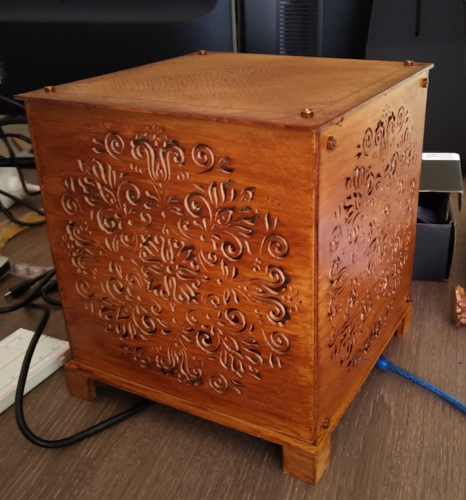
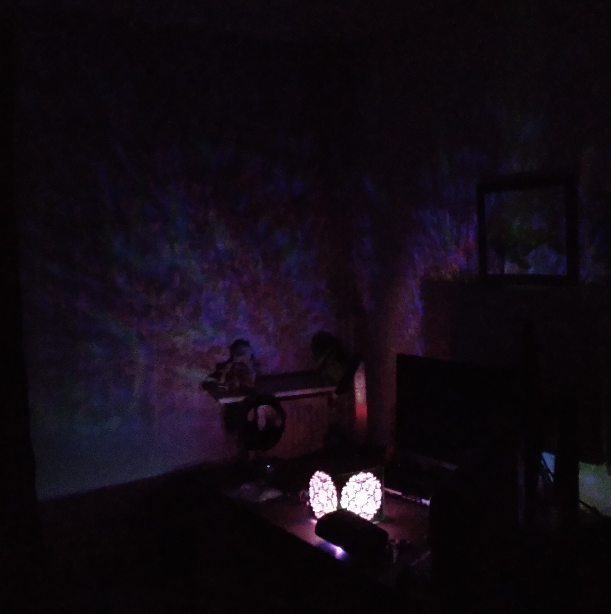

# arduilamp

## Description

This repository holds the code as well as the STL files and PCB design to create a RGB lamp with an Arduino board.

The lamp itself supports several modes for speed, brightness & animation, all of which are cycled using 3 buttons connected to the controller.

## BOM

You'll also need a make of the PCB available under the **pcb** folder as well as a print of one of the lamp models (see the **stl/** folder for details).
The rest of the BOM is the same for all lamp models.

| Piece  | Count  | Link  | Note |
|---|---|---|---|
| Arduino nano ATmega238P | x1  | [Amazon](https://www.amazon.fr/gp/product/B0722YYBSS/ref=ppx_yo_dt_b_asin_title_o07_s00?ie=UTF8&psc=1) | |
| 5V power plug | x1 | [Amazon](https://www.amazon.fr/gp/product/B07G953WC3/ref=ppx_yo_dt_b_asin_title_o09_s01?ie=UTF8&psc=1) | Since those are micro USB, I had to use a [Micro usb to mini USB breakout adapter board](https://www.amazon.fr/gp/product/B07R9SMJKF/ref=ppx_yo_dt_b_asin_title_o02_s00?ie=UTF8&psc=1) |
| WS2812B strip | x1 | [Amazon](https://www.amazon.fr/gp/product/B00JR0MJIU/ref=ppx_yo_dt_b_asin_title_o09_s01?ie=UTF8&psc=1) | |
| 10 kOhm resistor | x3 | [Amazon](https://www.amazon.fr/gp/product/B071LHFQKD/ref=ppx_yo_dt_b_asin_title_o07_s00?ie=UTF8&psc=1) | |
| Push button | x3 | [Amazon](https://www.amazon.fr/gp/product/B01E6SBB5E/ref=ppx_yo_dt_b_search_asin_title?ie=UTF8&psc=1) | |

Not included are tools like wires, soldering iron, a 3D printer and some tools to clean-up your prints.
